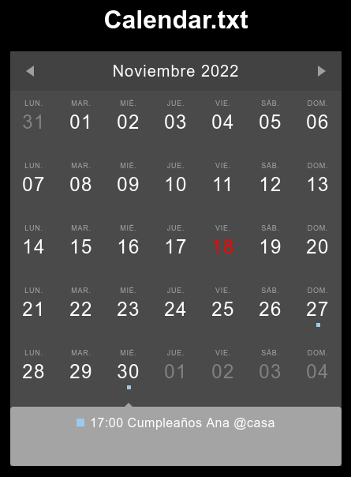

# calendar.txt-web

Viewing future events in calendar.txt can be awkward at times. calendar.txt-web will make it possible to view events in a graphical way.

Many thanks to [atareao](https://github.com/atareao) from [atareao.es](https://atareao.es/) for starting this project and to [rapejim](https://github.com/rapejim) for adapting it to the Spanish language and ordering the days of the week by Monday.
